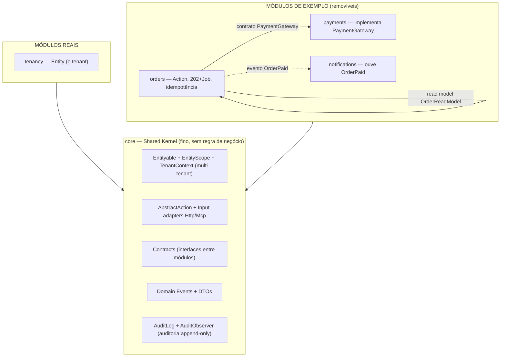
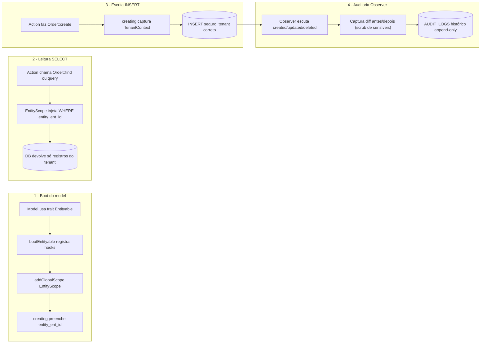

# Arquitetura — o paradigma modular

> Este documento explica **por que** o sistema é organizado como é. A mecânica do
> pacote está em [`MODULOS.md`](MODULOS.md); o shared kernel em [`CORE.md`](CORE.md);
> a comunicação entre módulos em [`COMUNICACAO.md`](COMUNICACAO.md); o enforcement
> em [`FRONTEIRAS.md`](FRONTEIRAS.md).

## Camadas técnicas vs. módulos: a mudança de eixo

Organizar por **tipo técnico** (uma pasta `Controllers`, uma `Services`, uma
`Models`) responde à pergunta *"que tipo de coisa é este arquivo?"*. Funciona em
projeto pequeno, mas conforme cresce, a lógica de uma mesma funcionalidade fica
espalhada por 6 pastas — para entender "processamento de pedido" você abre o
Controller numa pasta, o Service em outra, o Job em outra, o Model em outra.

A arquitetura modular muda o eixo: organiza por **capacidade de negócio**
(*bounded context*). A pergunta passa a ser *"a que parte do negócio este arquivo
pertence?"*. Tudo que é "pedido" mora junto, no módulo `orders`; tudo que é
"pagamento" mora no módulo `payments`. Dentro de cada módulo ainda há as subpastas
técnicas (`Models`, `Actions`, `Jobs`...), mas elas vivem **dentro da fronteira do
módulo**.

| Aspecto                          | Por camadas (tradicional)   | Por módulos (este template)          |
| -------------------------------- | --------------------------- | ------------------------------------ |
| Eixo de organização              | Tipo técnico do arquivo     | Capacidade de negócio                |
| "Onde está a lógica de pedido?"  | Espalhada em 6 pastas       | Num módulo `orders` só               |
| Adicionar provedor/integração    | Mexe em várias pastas       | Um arquivo no módulo dono            |
| Risco de acoplamento             | Tudo acessa tudo            | Fronteira impede acesso indevido     |
| Achar código                     | Por tipo, navegação plana   | Por domínio, navegação semântica     |

## O conceito de fronteira (a parte que importa de verdade)

O ganho real não é a pasta bonita — é a **fronteira**. Num monólito tradicional,
qualquer classe pode chamar qualquer outra. Na arquitetura modular, cada módulo é
um *bounded context* com uma fronteira explícita: o módulo `orders` **não pode**
importar uma classe interna do módulo `payments`. Ele só fala com `payments` por
uma **porta da frente** (um contrato/interface declarado no `core`).

Parece restrição chata, mas é exatamente o que protege o sistema. Pense no ativo
mais sensível do seu domínio (a chave privada de um certificado, o token de um
gateway de pagamento, o segredo de um webhook): se qualquer parte do código pode
dar `Model::find()` e ler o dado, um bug em qualquer lugar pode vazá-lo. Se só o
módulo dono toca a tabela, e todo mundo pede a *capacidade* por um contrato, o
vazamento fica **fisicamente impossível por construção**.

> **A regra de uma frase:** modular de verdade = *um módulo nunca importa a classe
> interna de outro; eles se comunicam por contratos e eventos*. Sem essa regra,
> você só tem "pastas com nomes bonitos" e, em 6 meses, o mesmo emaranhado de
> antes — só que com mais diretórios. O detalhamento dos 3 mecanismos de
> comunicação está em [`COMUNICACAO.md`](COMUNICACAO.md).

### Por que isso importa AINDA MAIS com IA escrevendo código

Este template é desenhado para desenvolvimento orientado a IA. Um agente de código
é extraordinariamente produtivo — e extraordinariamente literal: ele faz o que o
contexto permite. Num monólito sem fronteiras, "o contexto permite" importar
qualquer coisa de qualquer lugar, e a IA o fará com a melhor das intenções. Com a
fronteira **executável** (ArchTest), a violação não depende de revisão humana
atenta: o teste quebra, a IA vê o erro e corrige a rota — sozinha. A arquitetura
vira o trilho; a IA vira o trem. O que sobra para o humano é o que só ele pode
fazer: decidir o negócio, modelar o domínio e traduzir regras em contratos.

## Modular monolith ≠ microsserviços

Importante não confundir: **não** há vários serviços rodando separado com HTTP
entre eles. É um **único** app Laravel, um único deploy, um único PostgreSQL. A
modularidade é **interna** — fronteiras no código, não na infraestrutura. A
comunicação entre módulos é *in-process* (chamada de método via interface, ou
evento), rápida e simples. É a organização e o isolamento dos microsserviços com a
simplicidade operacional do monólito.

Dois erros simétricos a evitar (ambos destroem o propósito):

- **Colapsar a fronteira:** compartilhar models e o mesmo acesso a banco entre
  módulos como se a fronteira não existisse. Vira monólito espaguete disfarçado.
- **Supercompensar:** colocar HTTP ou message bus *entre* módulos do mesmo
  processo, fingindo que são microsserviços. Complexidade gratuita.

## Mapa de módulos do template

A mecânica o pacote dá; *quais* módulos criar é decisão de modelagem de domínio
(feita no `/prontuario`). Princípio: organizar em torno de *bounded contexts*,
separando o **núcleo crítico** do seu negócio (alto risco) da **periferia**
(apoio/operacional). O template nasce com o mínimo + um exemplo completo:



Linha cheia = dependência por **contrato/interface** (chamada direta, mas só pela
porta da frente). Linha tracejada = **evento de domínio** (desacoplamento total —
o emissor não conhece quem ouve). Tudo aponta para `core`; `core` não aponta para
ninguém.

### Como desenhar OS SEUS módulos

Perguntas que orientam a partição (respondidas no `/prontuario`):

1. **Qual é o núcleo de alto risco?** O que tem validade legal, financeira ou de
   segurança fica em módulos próprios, com a menor superfície pública possível.
2. **O que muda por força externa?** Integrações (gateways, ERPs, provedores)
   ganham módulo com Strategy atrás de contrato — trocar de provedor vira bind,
   não reescrita.
3. **O que é periferia comercial/operacional?** Faturamento, tokens de API,
   webhooks, notificações — módulos de baixo risco que não podem, por construção,
   tocar o núcleo.
4. **O que gira em torno do mesmo agregado?** Operações do mesmo agregado (criar/
   consultar/cancelar um pedido) ficam no MESMO módulo como *vertical slices* —
   não crie fronteira artificial dentro de um agregado.

> **Anti-over-engineering:** não nasça com 12 módulos. Comece com `core`, o
> tenant e 2–4 módulos do núcleo do negócio; deixe capacidades de periferia na
> app host **até a fronteira doer** — e então extraia (a extração é barata porque
> cada módulo já é um pacote Composer). A disciplina de fronteira importa mais
> que a quantidade de fronteiras.

## Shared Kernel: o módulo `core`

Algumas coisas atravessam todos os módulos legitimamente: identidade do tenant,
value objects comuns, auditoria base, contratos. O padrão **Shared Kernel**
centraliza isso num módulo `core` do qual todos dependem — **e que não depende de
ninguém**. Detalhamento completo em [`CORE.md`](CORE.md).

## Multi-tenant automático — Entityable + EntityScope + Observer

A trait `Entityable` + `EntityScope` + `AuditObserver` vivem no `core` e são
usadas por todo model com escopo de tenant. A combinação elimina três bugs de uma
vez: vazamento entre tenants, criação com tenant errado e ausência de trilha de
auditoria. Custo: zero boilerplate por model — basta `use Entityable` e um
observer de 3 linhas.



**Atenção crítica:** Workers e canais sem sessão HTTP (MCP, CLI) **não têm** o
contexto do request. O job carrega o `entity_id` no payload e o restaura com
`TenantContext::runAs()` como PRIMEIRA instrução do `handle()`. Sem isso, o
multi-tenant vaza no primeiro `find()` esquecido. Como é infraestrutura
*cross-module* pura (sem regra de negócio), tudo isso mora no `core`.

## Fluxo de execução canônico (o exemplo executável)

O diagrama mais importante do template — todo fluxo de escrita relevante do SEU
sistema deve seguir este molde:

```mermaid
sequenceDiagram
  autonumber
  participant C as Cliente API (SPA / integração / IA via MCP)
  participant M as Middleware de borda (resolve tenant -> TenantContext)
  participant Ctrl as OrderController (módulo orders, adapter fino)
  participant ACT as PlaceOrderAction (módulo orders)
  participant Mdl as Model Order (Entityable do core)
  participant DB as Banco
  participant Obs as OrderObserver -> AuditObserver (core)
  participant Q as Fila (Redis, fila nomeada "orders")
  participant W as Worker (ProcessOrderPaymentJob)
  participant GW as PaymentGateway (contrato core; impl. payments)
  participant NT as notifications (listener queued)
  C->>M: POST /v1/orders {ref, customer, amount}
  M->>M: valida credencial, resolve entity_id -> TenantContext
  M->>Ctrl: request autenticada
  Ctrl->>ACT: execute(HttpInputAdapter::from(request))
  ACT->>ACT: sanitize -> validate -> authorize
  ACT->>ACT: idempotência: ref já existe? devolve o existente
  ACT->>Mdl: Order::create(status=processing_payment)
  Mdl->>Mdl: Entityable preenche entity_ent_id
  Mdl->>DB: INSERT orders
  DB-->>Obs: evento created
  Obs->>DB: INSERT audit_logs (append-only)
  ACT->>Q: ProcessOrderPaymentJob::dispatch(ord_id, entity_id) onQueue('orders')
  ACT-->>Ctrl: order (processing_payment)
  Ctrl-->>C: HTTP 202 + OrderResource
  Note over Q,W: Processamento assíncrono
  Q->>W: entrega o job
  W->>W: TenantContext::runAs(entity_id) — PRIMEIRA instrução
  W->>Mdl: Order::findOrFail (EntityScope filtra)
  W->>GW: charge(ord_id, amount)  [via contrato]
  alt aprovado
    GW-->>W: PaymentResult::approved
    W->>Mdl: update(status=paid, paid_at)
    DB-->>Obs: updated -> audit_logs (diff)
    W->>NT: event(OrderPaid) — sem conhecer os ouvintes
  else recusa DE NEGÓCIO
    GW-->>W: PaymentResult::declined(motivo)
    W->>Mdl: update(status=payment_failed, motivo) — estado final, SEM retry
  else erro de TRANSPORTE (timeout/5xx)
    GW--xW: lança PaymentGatewayUnavailableException
    W->>Q: exceção sobe -> re-enfileira (backoff, tries=5) — nunca captura
  end
```

Os quatro desfechos (síncrono 202 / autorizado / recusado / retry) e a distinção
**transporte lança × negócio retorna** são o coração da resiliência (regra de
ouro nº 7).

## Plano de nascimento de um sistema novo

1. **Rode `/prontuario`** — entrevista, docs de domínio, nome/namespace, módulos.
2. **Crie o(s) contrato(s) no `core` primeiro**, mesmo vazios — a porta antes da
   casa.
3. **Crie os módulos do núcleo** (`/novo-modulo`), implementando os contratos.
4. **Deixe a periferia na app host até doer** — extraia módulos quando a
   fronteira se pagar.
5. **O ArchTest já existe** — módulo novo entra na constante `DOMAIN_MODULES` e
   ganha as regras de graça (o `/novo-modulo` faz isso).
6. **`modules:cache` em produção** para o ganho de auto-discovery.

> **O custo honesto:** a parte cara não é instalar o pacote (10 min) — é manter a
> disciplina de fronteira sob pressão de prazo. O retorno aparece na *segunda*
> integração e no *segundo* tipo de documento/fluxo, quando estender vira
> "adiciona um arquivo no módulo" em vez de "caça os 8 lugares que precisam saber
> disso". Aposta assimétrica a favor de modularizar o núcleo — e contra
> modularizar tudo.

## Documentos relacionados

- [`MODULOS.md`](MODULOS.md) — o pacote `internachi/modular`, instalação, árvores de arquivo
- [`CORE.md`](CORE.md) — o shared kernel em detalhe
- [`COMUNICACAO.md`](COMUNICACAO.md) — contratos, eventos, read models, DTO
- [`FRONTEIRAS.md`](FRONTEIRAS.md) — testes de arquitetura e enforcement de fronteira
- [`IMPLEMENTACAO.md`](IMPLEMENTACAO.md) — FAQ de código (jobs, resolver, canais, Resource)
- [`BANCO.md`](BANCO.md) — modelo de dados e ownership de tabela por módulo
- [`CODE_STYLE.md`](CODE_STYLE.md) — convenções e namespaces de módulo
