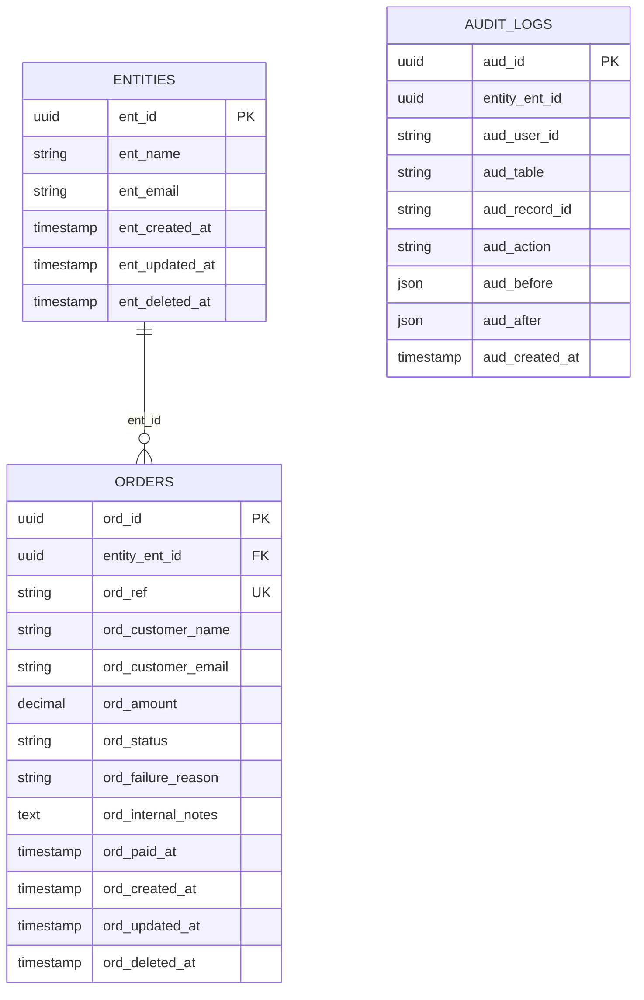

# Banco de dados — convenções e ownership

**PostgreSQL 16 próprio** em produção (sem Postgres-as-a-service; dev rápido usa
sqlite) acessado **somente via Eloquent**. Nenhuma query crua fora dos
Models/Services do módulo dono.

## Ownership de tabela por módulo

Banco único, mas **disciplina de ownership**: cada tabela pertence a um módulo, e
**só o módulo dono faz query nela**. Se outro módulo precisa do dado, pede via
contrato ou read model, nunca via Eloquent cru atravessando a fronteira (ver
[`COMUNICACAO.md`](COMUNICACAO.md)). As migrations/factories de cada tabela vivem
em `app-modules/<modulo>/database/`.

Estado atual do template:

| Tabela       | Prefixo | PK       | FK típica       | Módulo dono                  |
| ------------ | ------- | -------- | --------------- | ---------------------------- |
| `entities`   | `ent_`  | `ent_id` | `entity_ent_id` | `tenancy`                    |
| `audit_logs` | `aud_`  | `aud_id` | —               | `core`                       |
| `orders`     | `ord_`  | `ord_id` | `order_ord_id`  | `orders` [EXEMPLO]           |
| `users`, `cache`, `jobs` | — | `id` | —          | host (esqueleto Laravel)     |

> As tabelas do esqueleto Laravel (`users`, `cache`, `jobs`, `sessions`...) são
> infraestrutura do framework e não seguem as convenções de domínio — não as
> imite. Ao criar o SEU sistema, cada tabela nova nasce num módulo, com prefixo.
> Mantenha esta tabela atualizada a cada migration (a skill `/sync-docs` cobra).

## Convenção de nomenclatura

- Toda tabela de domínio usa um **prefixo de 3 letras** em **todas** as colunas
  (`ord_`, `ent_`, `aud_`...). Por quê: (1) toda coluna é imediatamente
  rastreável à tabela de origem em joins, logs e diffs de auditoria; (2) nunca
  há colisão de nome em joins (`ord_created_at` × `ent_created_at`); (3) o
  audit_log fica legível sem contexto.
- Chaves estrangeiras seguem `{tabela_origem_singular}_{coluna_pk_origem}` —
  ex.: a FK para `entities` (PK `ent_id`) é a coluna **`entity_ent_id`**.
- PK é **UUID**: `$incrementing = false`, `$keyType = 'string'`, `$primaryKey`
  explícito, `use HasUuids`. Por quê: IDs gerados na aplicação (jobs referenciam
  o registro antes do INSERT confirmar), não-enumeráveis (segurança em APIs) e
  mescláveis entre ambientes.
- Colunas de tempo seguem o prefixo da tabela: `ord_created_at`,
  `ord_updated_at`, `ord_deleted_at` (constantes no model). Tabelas
  transacionais usam **SoftDeletes** — nada de domínio some fisicamente (e o
  audit_log registra o `deleted`).

### Configuração no Model (o molde completo)

```php
// app-modules/orders/src/Models/Order.php (real)
#[ObservedBy([OrderObserver::class])]           // auditoria
final class Order extends Model
{
    use Entityable;                             // multi-tenant (core)
    use HasFactory;
    use HasUuids;                               // PK UUID gerada na app
    use SoftDeletes;

    protected $table = 'orders';
    protected $primaryKey = 'ord_id';
    public $incrementing = false;
    protected $keyType = 'string';

    public const CREATED_AT = 'ord_created_at';
    public const UPDATED_AT = 'ord_updated_at';
    public const DELETED_AT = 'ord_deleted_at';

    protected $guarded = [];

    protected static function newFactory(): OrderFactory
    {
        return OrderFactory::new();             // factory do módulo, explícita
    }

    protected function casts(): array
    {
        return [
            'ord_amount' => 'decimal:2',
            'ord_status' => OrderStatus::class, // enum para conjunto fechado
            'ord_paid_at' => 'datetime',
        ];
    }
}
```

## Diagrama ER (estado do template)



## Notas

- **Multi-tenant:** toda tabela com `entity_ent_id` é filtrada automaticamente
  pelo `EntityScope` e preenchida pelo trait `Entityable` (ambos no `core`) a
  partir do `TenantContext::id()` — resolvido pelo middleware no HTTP e
  restaurado com `TenantContext::runAs()` em jobs/workers. Ver
  [`ARQUITETURA.md`](ARQUITETURA.md).
- **Idempotência:** o índice único de `orders` é `(entity_ent_id, ord_ref)` — a
  mesma `ref` não cria dois registros dentro do tenant; refs `NULL` não colidem.
  Se o seu sistema tiver ambientes (homologação × produção), inclua o ambiente
  no índice: `(entity_ent_id, ref, environment)`.
- **`audit_logs`** é *append-only*: gravada pelo `AuditObserver` (no `core`) nos
  eventos `created/updated/deleted/restored` com o diff `aud_before`/`aud_after`.
  Não sofre `update`/`delete`. **Sem FKs de propósito** — a trilha sobrevive ao
  registro auditado. `aud_record_id` é string (tolera PKs não-UUID, ex.: o
  `users` do host); `aud_user_id` idem.
- **Colunas sensíveis** (senhas cifradas, chaves, payloads privados) ficam FORA
  do diff de auditoria via `$hidden` do observer concreto — e fora do Resource
  da API. Teste as duas coisas (o template mostra como).
- **Atravessar fronteira para ler dado de outro módulo:** sempre via contrato ou
  read model/DTO (ver [`COMUNICACAO.md`](COMUNICACAO.md)). Relação Eloquent
  cross-módulo: `config/models.php`.
- **Retenção:** defina a política do seu domínio (documentos fiscais: 5 anos;
  logs de request: 90 dias...) e registre-a aqui quando o `/prontuario` rodar.
