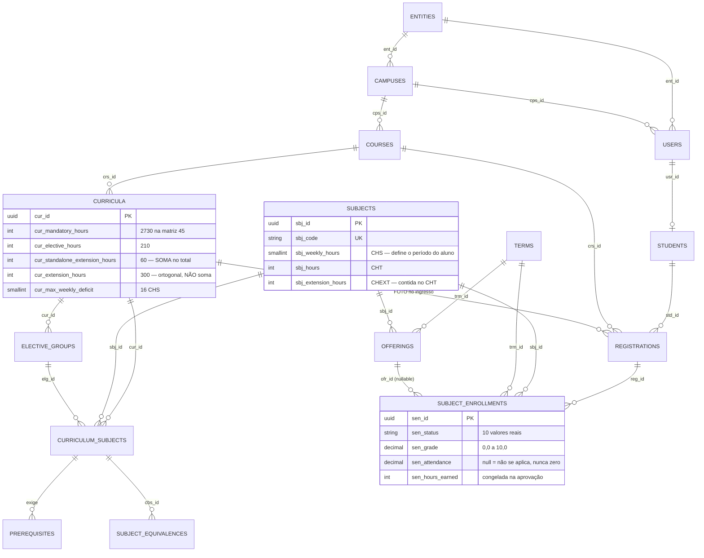

# Banco de dados — convenções e ownership

**PostgreSQL 16 próprio** em produção (sem Postgres-as-a-service; dev rápido usa
sqlite) acessado **somente via Eloquent**. Nenhuma query crua fora dos
Models/Services do módulo dono.

## Ownership de tabela por módulo

Banco único, mas **disciplina de ownership**: cada tabela pertence a um módulo, e
**só o módulo dono faz query nela**. Se outro módulo precisa do dado, pede via
contrato ou read model, nunca via Eloquent cru atravessando a fronteira (ver
[`COMUNICACAO.md`](COMUNICACAO.md)). As migrations/factories de cada tabela vivem
em `app-modules/<modulo>/database/`.

**Estado atual — 17 tabelas de domínio em código:**

| Tabela | Prefixo | PK | Módulo dono |
| --- | --- | --- | --- |
| `entities` | `ent_` | `ent_id` | `tenancy` — **o tenant: a instituição de ensino** |
| `campuses` | `cps_` | `cps_id` | `tenancy` |
| `users` | `usr_` | `usr_id` | `tenancy` |
| `audit_logs` | `aud_` | `aud_id` | `core` |
| `courses` | `crs_` | `crs_id` | `catalog` |
| `curricula` | `cur_` | `cur_id` | `catalog` |
| `subjects` | `sbj_` | `sbj_id` | `catalog` |
| `curriculum_subjects` | `cbs_` | `cbs_id` | `catalog` |
| `prerequisites` | `prq_` | `prq_id` | `catalog` |
| `elective_groups` | `elg_` | `elg_id` | `catalog` |
| `subject_equivalences` | `seq_` | `seq_id` | `catalog` |
| `terms` | `trm_` | `trm_id` | `catalog` |
| `offerings` | `ofr_` | `ofr_id` | `catalog` |
| `students` | `std_` | `std_id` | `journey` |
| `registrations` | `reg_` | `reg_id` | `journey` |
| `subject_enrollments` | `sen_` | `sen_id` | `journey` |
| `enrollment_requests` | `erq_` | `erq_id` | `journey` — o documento que o aluno subiu |
| `users`(framework), `cache`, `jobs`, `sessions`, `personal_access_tokens` | — | — | host (infra do Laravel/Sanctum) |

> As tabelas de infraestrutura do framework não seguem as convenções de domínio
> — não as imite. O `users` do esqueleto do Laravel foi **removido**: no
> CampusOS o usuário é model de domínio, com escopo de tenant e auditoria.

**Cinco decisões de modelagem que vale conhecer antes de mexer:**

1. **`subjects` é global na instituição, não por curso.** É o que faz a anotação
   do veterano de Engenharia chegar ao calouro de Química que cursa a mesma
   Cálculo 1 — e é nessa tabela que o acervo do desafio 5.2 se pendura.
2. **`curriculum_subjects` é a disciplina DENTRO de uma matriz.** `cbs_term` é o
   período *sugerido* (a linha da grade impressa), não onde o aluno cursou —
   isso é `subject_enrollments.term_trm_id`. Confundir os dois é o bug nº 1 de
   sistema acadêmico.
3. **`prerequisites` aponta para `curriculum_subjects` nos dois lados**, porque
   pré-requisito é da matriz, não da disciplina. `required_cbs_id` é nullable:
   `EST501` exige "Período: 5", não uma disciplina.
4. **`registrations.curriculum_cur_id` é uma FOTO** congelada no ingresso e
   nunca reescrita — sem isso, uma reforma curricular mudaria a barra de
   progresso de toda a instituição de uma vez.
5. **`subject_enrollments` tem índice único `(registration, subject, term)`.**
   Cursar de novo em outro semestre é permitido e gera linha nova: é assim que
   reprovação aparece no histórico, e daí sai a contagem de tentativas de graça.

## Convenção de nomenclatura

- Toda tabela de domínio usa um **prefixo de 3 letras** em **todas** as colunas
  (`ord_`, `ent_`, `aud_`...). Por quê: (1) toda coluna é imediatamente
  rastreável à tabela de origem em joins, logs e diffs de auditoria; (2) nunca
  há colisão de nome em joins (`ord_created_at` × `ent_created_at`); (3) o
  audit_log fica legível sem contexto.
- Chaves estrangeiras seguem `{tabela_origem_singular}_{coluna_pk_origem}` —
  ex.: a FK para `entities` (PK `ent_id`) é a coluna **`entity_ent_id`**.
- PK é **UUID**: `$incrementing = false`, `$keyType = 'string'`, `$primaryKey`
  explícito, `use HasUuids`. Por quê: IDs gerados na aplicação (jobs referenciam
  o registro antes do INSERT confirmar), não-enumeráveis (segurança em APIs) e
  mescláveis entre ambientes.
- Colunas de tempo seguem o prefixo da tabela: `ord_created_at`,
  `ord_updated_at`, `ord_deleted_at` (constantes no model). Tabelas
  transacionais usam **SoftDeletes** — nada de domínio some fisicamente (e o
  audit_log registra o `deleted`).

### Configuração no Model (o molde completo)

```php
// app-modules/journey/src/Models/SubjectEnrollment.php (real)
#[ObservedBy([SubjectEnrollmentObserver::class])]   // auditoria
final class SubjectEnrollment extends Model
{
    use Entityable;                             // multi-tenant (core)
    use HasFactory;
    use HasUuids;                               // PK UUID gerada na app
    use SoftDeletes;

    protected $table = 'subject_enrollments';
    protected $primaryKey = 'sen_id';
    public $incrementing = false;
    protected $keyType = 'string';

    public const CREATED_AT = 'sen_created_at';
    public const UPDATED_AT = 'sen_updated_at';
    public const DELETED_AT = 'sen_deleted_at';

    protected $guarded = [];

    protected static function newFactory(): SubjectEnrollmentFactory
    {
        return SubjectEnrollmentFactory::new();  // factory do módulo, explícita
    }

    protected function casts(): array
    {
        return [
            'sen_status' => EnrollmentStatus::class,  // enum p/ conjunto fechado
            'sen_grade' => 'float',
            'sen_attendance' => 'float',              // null = não se aplica
        ];
    }
}
```

## Diagrama ER

Só as relações estruturais; toda tabela com escopo de tenant também carrega
`entity_ent_id` apontando para `entities` (omitido para não virar ruído).



> **O total a integralizar é calculado, não armazenado:**
> `cur_mandatory_hours + cur_elective_hours + cur_standalone_extension_hours`
> = 2730 + 210 + 60 = **3000 h**. Não existe `cur_total_hours` de propósito —
> duas fontes para o mesmo número sempre acabam discordando. A fórmula é a do
> próprio documento da matriz; ver
> [`DOCUMENTOS_ACADEMICOS.md`](../dominio/DOCUMENTOS_ACADEMICOS.md) §4.3.

## Notas

- **Multi-tenant:** toda tabela com `entity_ent_id` é filtrada automaticamente
  pelo `EntityScope` e preenchida pelo trait `Entityable` (ambos no `core`) a
  partir do `TenantContext::id()` — resolvido pelo middleware no HTTP e
  restaurado com `TenantContext::runAs()` em jobs/workers. Ver
  [`ARQUITETURA.md`](ARQUITETURA.md).
- **Idempotência:** o índice único de `subject_enrollments` é
  `(registration_reg_id, subject_sbj_id, term_trm_id)` — reimportar o mesmo
  histórico não duplica linha, e cursar de novo em OUTRO semestre continua
  permitido (é assim que reprovação aparece). O de `users` é
  `(entity_ent_id, usr_email)`: o mesmo e-mail pode existir em duas
  instituições, e é por isso que o login roda fora do escopo de tenant.
- **`audit_logs`** é *append-only*: gravada pelo `AuditObserver` (no `core`) nos
  eventos `created/updated/deleted/restored` com o diff `aud_before`/`aud_after`.
  Não sofre `update`/`delete`. **Sem FKs de propósito** — a trilha sobrevive ao
  registro auditado. `aud_record_id` é string (tolera PKs não-UUID, ex.: o
  `users` do host); `aud_user_id` idem.
- **Colunas sensíveis** (senhas cifradas, chaves, payloads privados) ficam FORA
  do diff de auditoria via `$hidden` do observer concreto — e fora do Resource
  da API. Teste as duas coisas (o template mostra como).
- **Atravessar fronteira para ler dado de outro módulo:** sempre via contrato ou
  read model/DTO (ver [`COMUNICACAO.md`](COMUNICACAO.md)). Relação Eloquent
  cross-módulo: `config/models.php`.
- **Retenção:** defina a política do seu domínio (documentos fiscais: 5 anos;
  logs de request: 90 dias...) e registre-a aqui quando o `/prontuario` rodar.
