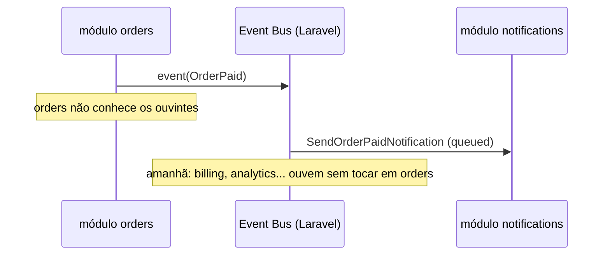

# Comunicação entre módulos

É aqui que a maioria dos projetos modulares fracassa. Há **três mecanismos**, em
ordem de preferência. A escolha rápida:

| Pergunta que você faz                | Mecanismo          | Espera retorno? | Conhece o outro lado?              |
| ------------------------------------ | ------------------ | --------------- | ---------------------------------- |
| "Faça X e me devolva o resultado"    | Interface/Contrato | Sim             | Conhece a interface (não a classe) |
| "Avisem-se: X aconteceu"             | Evento             | Não             | Não conhece ninguém                |
| "Me deixe ler seus dados"            | Read model/DTO     | Sim (dados)     | Conhece a interface de leitura     |

No exemplo executável do template, os três aparecem juntos: (1) cobrar o
pagamento → contrato; (2) pedido pago → evento; (3) dashboard lê o pedido →
read model com DTO.

## 1 · Contratos / Interfaces (chamada síncrona desacoplada)

Quando o módulo A precisa de uma capacidade do módulo B, A depende de uma
**interface declarada no `core`**, e B fornece a implementação (bind no service
provider de B). A nunca importa a classe concreta de B.

```php
// core/src/Contracts/PaymentGateway.php — a porta pública
namespace Modules\Core\Contracts;

interface PaymentGateway
{
    public function charge(string $reference, float $amount): PaymentResult;
}
```

```php
// payments/src/Gateways/FakePaymentGateway.php — implementação escondida
namespace Modules\Payments\Gateways;

use Modules\Core\Contracts\PaymentGateway;

final class FakePaymentGateway implements PaymentGateway
{
    public function charge(string $reference, float $amount): PaymentResult
    {
        // detalhes do provedor NUNCA vazam para fora do módulo payments
    }
}
```

```php
// orders/src/Jobs/ProcessOrderPaymentJob.php — consumidor
use Modules\Core\Contracts\PaymentGateway; // <- SÓ a interface

public function handle(PaymentGateway $gateway): void { /* ... */ }
```

```php
// payments/src/Providers/PaymentsServiceProvider.php — o bind
public function register(): void
{
    $this->app->bind(PaymentGateway::class, FakePaymentGateway::class);
}
```

Regra: **evite usar models ou classes diretamente de outros módulos — use
contratos.** Cada módulo é dono dos seus dados e expõe *capacidades*, não classes
internas.

> **Por que isso paga:** trocar o provedor de pagamento (ou de qualquer
> integração) vira "escreva uma classe nova implementando o contrato e mude o
> bind" — quem consome não muda uma linha. É o mesmo seam que permite, num teste,
> substituir a implementação real por uma fake determinística.

## 2 · Eventos de domínio (desacoplamento total)

Quando A só precisa *avisar* que algo aconteceu, sem se importar com quem ouve,
use evento. Quando um pedido é pago, `orders` publica `OrderPaid`;
`notifications` consome — sem que `orders` conheça ninguém.

```php
// core/src/Events/OrderPaid.php
namespace Modules\Core\Events;

final class OrderPaid
{
    public function __construct(
        public readonly string $orderId,
        public readonly string $entityId,
        public readonly ?string $ref,
        public readonly float $amount,
    ) {}
}
```

```php
// orders dispara — não sabe quem ouve:
event(new OrderPaid($order->ord_id, $order->entity_ent_id, $order->ord_ref, $amount));
```

```php
// notifications/src/Listeners/SendOrderPaidNotification.php — enfileirado
final class SendOrderPaidNotification implements ShouldQueue
{
    public function handle(OrderPaid $event): void { /* ... */ }
}
```



Regras do evento bem-feito:

- Carrega **IDs e primitivos**, nunca models Eloquent (o payload é serializado
  para a fila; o model não cruza fronteira).
- O nome é **fato passado** (`OrderPaid`, não `PayOrder`).
- Listener de outro módulo é `ShouldQueue` por padrão: a reação não pode atrasar
  nem derrubar a operação de quem emitiu.
- Registro **explícito** no provider do módulo ouvinte (`Event::listen`) — fica
  visível e auditável quem reage a quê.

## 3 · Dados privados por módulo

Princípio forte: **cada módulo é dono do seu estado — seus dados são privados.**
Num monólito com um único banco, isso não significa bancos separados — significa
**disciplina de ownership de tabela**: só `orders` faz query em `orders`. Se
outro módulo precisa do dado, pede via contrato ou read model, nunca via Eloquent
cru atravessando a fronteira. Ver a tabela de ownership em [`BANCO.md`](BANCO.md).

## Read model + DTO: leitura através da fronteira

Um **DTO** é um objeto burro que carrega dados tipados — sem lógica, sem banco.
Não é Factory (cria objetos) nem DAO (acessa banco): o DTO não *faz* nada, ele só
*é* uma forma tipada de passar dados. Em PHP moderno, classe com propriedades
`readonly`:

```php
// core/src/DTOs/OrderSummaryDTO.php
final class OrderSummaryDTO
{
    public function __construct(
        public readonly string $id,
        public readonly ?string $ref,
        public readonly string $status,
        public readonly float $amount,
    ) {}
}
```

Serve para **travessia de fronteira**: quando um dashboard, um painel admin ou
outro módulo precisa de dados de um pedido, não pode receber o model `Order` cru
(vazaria a fronteira). O `orders` expõe um read model que devolve DTOs:

```php
// core/src/Contracts/OrderReadModel.php  (a porta)
interface OrderReadModel
{
    public function summaryById(string $orderId): ?OrderSummaryDTO;
}

// orders/src/ReadModels/EloquentOrderReadModel.php  (implementação)
final class EloquentOrderReadModel implements OrderReadModel
{
    public function summaryById(string $orderId): ?OrderSummaryDTO
    {
        $order = Order::query()->find($orderId);   // model nunca sai daqui

        if ($order === null) {
            return null;
        }

        return new OrderSummaryDTO(
            id: $order->ord_id,
            ref: $order->ord_ref,
            status: $order->ord_status->value,
            amount: (float) $order->ord_amount,
        );
    }
}
```

> **DTO ≠ Resource.** O `OrderResource` (API Resource) serializa o Model em JSON
> para o cliente HTTP e vive dentro do dono dos dados; o `OrderSummaryDTO` cruza
> a fronteira entre módulos e o model nunca o acompanha. Servem a camadas
> diferentes — comparação completa em
> [`IMPLEMENTACAO.md`](IMPLEMENTACAO.md#resource-vs-dto-não-confunda).

## Relações Eloquent cross-módulo: `config/models.php`

Caso especial: uma relação Eloquent (`belongsTo`, `hasMany`) que aponta para o
model de OUTRO módulo exigiria importar a classe — proibido. A solução do
template: o model é resolvido por config.

```php
// core/src/Models/Concerns/Entityable.php (exemplo real do template)
public function entity(): BelongsTo
{
    return $this->belongsTo(config('models.entity'), EntityScope::COLUMN, 'ent_id');
}
```

Adicione uma chave em `config/models.php` sempre que precisar. Factories e testes
(helpers de teste, não código de produção) podem referenciar classes diretamente.

## Painéis e front-ends preservam a fronteira

- **Painel admin (Filament, se instalado):** os Resources vivem dentro de cada
  módulo (`app-modules/x/src/Filament/Resources/`); o painel central os descobre.
  Resource que cruza dados de vários módulos usa um read model, não Eloquent cru.
- **SPA (React/Angular/Vue):** consome a API REST — que já termina nas Actions
  dos módulos. A fronteira nem chega a ser tentada.
- **Dashboards server-side (Livewire/Inertia, se instalados):** o controller
  injeta read models (interfaces do `core`) e devolve DTOs para a view — nunca o
  Eloquent cru de outro módulo. Preserva a fronteira até na apresentação.
