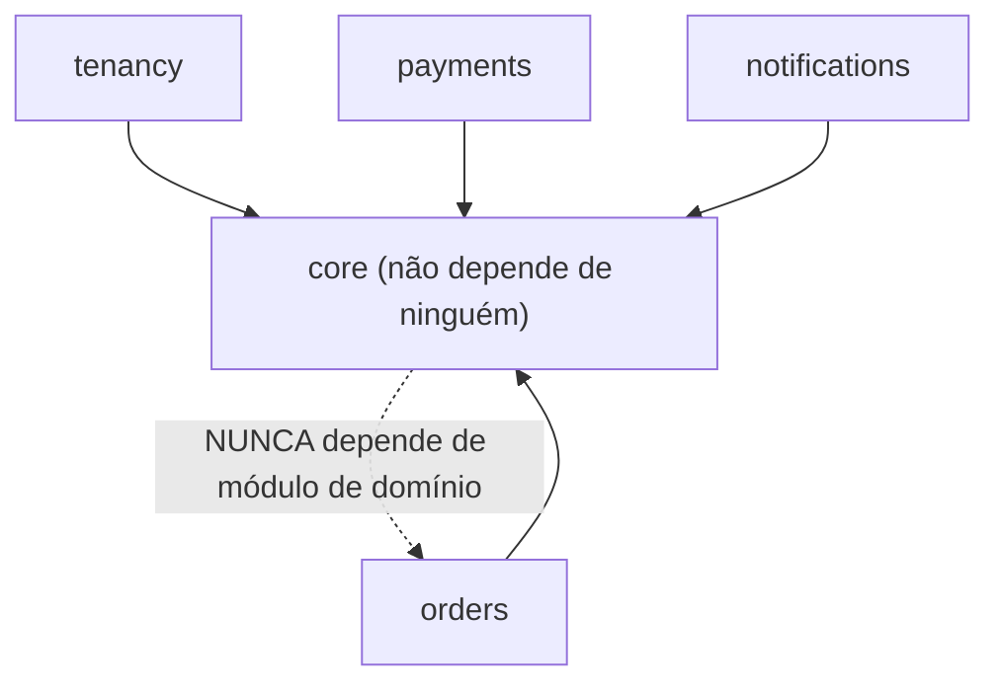

# Shared Kernel — o módulo `core`

Algumas coisas atravessam todos os módulos legitimamente: identidade do tenant,
auditoria base, contratos de fronteira, tipos burros de dados. O padrão **Shared
Kernel** centraliza isso num módulo `core` do qual todos dependem — **e que não
depende de ninguém**.

## O que o `core` abriga

- **Trait `Entityable` + `EntityScope` + `TenantContext`** — multi-tenant
  automático, usado por todo model de todo módulo com escopo de tenant.
- **`AbstractAction` + Input adapters** (`HttpInputAdapter`, `McpInputAdapter`) —
  o esqueleto compartilhado entre Controllers, Tools MCP e qualquer canal futuro.
- Os **Contracts** — interfaces que definem como um módulo fala com outro. No
  template: `PaymentGateway` e `OrderReadModel` (exemplos, removíveis). No SEU
  sistema: uma interface por capacidade que cruza fronteira.
- **DTOs** de travessia de fronteira (`PaymentResult`, `OrderSummaryDTO` —
  exemplos) — objetos imutáveis (`readonly`) que carregam dados tipados.
- **Domain Events** (`OrderPaid` — exemplo) — avisos imutáveis com IDs e
  primitivos, nunca models.
- **Exceptions de fronteira** (`PaymentGatewayUnavailableException` — exemplo) —
  erros que precisam ser reconhecidos por mais de um módulo.
- **`AuditLog` + `AuditObserver`** — a trilha de auditoria append-only e o
  observer base que os módulos estendem.
- **`audit:query`** — consulta da trilha via CLI.
- **ValueObjects** — quando o seu domínio tiver tipos com validação intrínseca
  (documento fiscal, referência, moeda), eles nascem aqui SE forem usados por
  mais de um módulo; senão, no módulo dono.

## Dependência unidirecional estrita

A seta tracejada de volta é **proibida**: o `core` jamais depende de um módulo de
domínio. Essa dependência unidirecional estrita elimina por construção o pesadelo
da dependência circular. O teste de arquitetura em [`FRONTEIRAS.md`](FRONTEIRAS.md)
faz o CI quebrar se alguém furar essa regra.

Repare no detalhe do próprio template: a relação `entity()` do trait `Entityable`
precisa do model do tenant (que mora no `tenancy`) — e o core NÃO pode importá-lo.
Solução: `config('models.entity')` (ver `config/models.php`). Esse é o padrão
para toda relação Eloquent que cruza fronteira.

## A regra de ouro do shared kernel

> O `core` **nunca** pode virar lixeira. Tudo que carrega significado de negócio
> fica *dentro* do seu módulo.

- **Entidades e agregados** (`Order`, os SEUS agregados) pertencem aos seus
  módulos — movê-los para o `core` acopla todo mundo à evolução deles.
- **Regras de negócio** (validação de domínio, services, policies) nunca vão para
  o código compartilhado.
- **Libs pesadas** não entram, senão todo módulo herda a dependência.

Quando bater a dúvida *"isso vai para o core?"*, a resposta default é **não**. Só
entra o que é, ao mesmo tempo, (1) usado por mais de um módulo e (2) sem regra de
negócio própria: infraestrutura transversal pura (tenant, auditoria), contratos
de fronteira, e tipos burros de dados (value objects, DTOs, eventos).

## Por que `Entityable`/`EntityScope`/`TenantContext` vivem aqui

O tenant atual mora num único ponto: o `TenantContext`. É resolvido pelo
Middleware de borda (HTTP), por um adapter de canal (MCP/CLI, a partir da
credencial) e restaurado no Worker via `TenantContext::runAs()` (a partir do
payload do job). É **infraestrutura cross-module pura, sem regra de negócio** —
exatamente o perfil do shared kernel. Todo model de todo módulo faz
`use Entityable` e ganha o filtro de tenant automático sem boilerplate. Detalhe
do fluxo multi-tenant em
[`ARQUITETURA.md`](ARQUITETURA.md#multi-tenant-automático--entityable--entityscope--observer).

## Por que a auditoria vive aqui

`audit_logs` registra mutações de **todos** os módulos e de **todos** os tenants
— é transversal por natureza. O `AuditObserver` é uma classe-base: cada módulo
registra um observer concreto de 3 linhas (via `#[ObservedBy]`) que herda toda a
mecânica (diff, scrub de colunas sensíveis, best-effort) e só declara o que é
específico dele (`$hidden`). O `AuditLog` **não usa Entityable** de propósito: a
trilha não é filtrada por tenant (consultas administrativas atravessam tenants) e
é **append-only** — nenhum código, em lugar nenhum, faz update/delete nela.

## Single-tenant? O core continua valendo

Se o seu sistema não for multi-tenant, NÃO desmonte o core: apenas não use
`Entityable` nos models (e remova o módulo `tenancy`). Auditoria, Actions,
adapters, contratos e DTOs continuam idênticos. Se um dia o sistema virar
multi-tenant, o caminho já está pavimentado.
