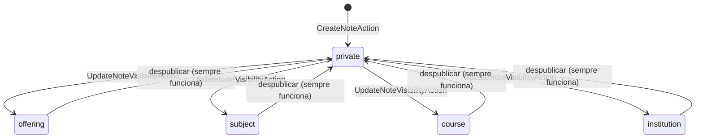

# Acervo do veterano — a nota que atravessa semestres

> **Área:** `lifeos` · **Última sincronização:** v0.5.0 · 2026-09-19

## O problema de negócio

Toda turma produz conhecimento — resumos, listas resolvidas, o aviso de que a
prova cobra o capítulo 4 e não o 5. Toda turma perde esse conhecimento quando
acaba: o grupo de WhatsApp morre, o Drive não tem quem organize, e a turma
seguinte recomeça do zero. O desafio 5.2 do HackLab pede para aproximar
calouros e veteranos — a resposta do CampusOS é fazer a entrega **automática**,
não voluntária: o veterano publica uma vez, para ninguém em particular, e o
sistema entrega para quem se matricular na mesma disciplina, anos depois.

Desenho completo (com a linha do tempo e o porquê de cada decisão) em
[`docs-site/features/acervo-compartilhado.html`](../../docs-site/features/acervo-compartilhado.html) —
canônico para as Fases 3–4 (tarefas da turma, curadoria por voto), que ainda
não têm código.

## As regras

1. **Uma nota nasce sempre privada.** Publicar é ato deliberado do autor — nem
   o cliente escolhendo outra visibilidade na criação muda isso.
   `CreateNoteAction` ignora esse campo e força `private`.
2. **A escada tem cinco degraus:** `private` (só o autor) → `offering` (a
   turma, naquele semestre) → `subject` (quem já cursou a disciplina, **em
   qualquer semestre**) → `course` (todo o curso) → `institution` (a
   instituição inteira). A linha entre `offering` e `subject` é onde o
   produto acontece: abaixo dela, a nota pertence a pessoas; a partir dela,
   pertence à disciplina.
3. **`subject` atravessa termo, de propósito.** É a ausência de filtro por
   `term_trm_id` na leitura que faz uma nota de 2024/1 chegar a quem se
   matricula em 2027/1 — o desafio 5.2 inteiro é essa ausência.
4. **Publicar exige saber para quem.** Subir para `subject`/`offering` sem
   `subject_sbj_id`/`offering_ofr_id` preenchido deixaria a nota "publicada"
   e invisível para todo mundo (nenhum `whereIn` do scope bateria) —
   `UpdateNoteVisibilityAction` recusa antes disso acontecer.
5. **Despublicar nunca tem pré-condição.** Voltar para `private` sempre
   funciona e tira a nota do acervo na hora.
6. **Autoria é sempre visível.** Acervo anônimo não cria pertencimento — que é
   literalmente o que o desafio pede — e piora a qualidade do que se publica.
7. **Nota de prova nunca aparece aqui.** `Note` não tem relação nenhuma com
   `subject_enrollments.sen_grade`/`sen_status` — o acervo compartilha
   conhecimento, nunca desempenho.
8. **Só o autor muda a visibilidade da própria nota.** Quem só enxerga (porque
   foi compartilhada) não pode alterá-la — 403 explícito no controller.

## O fluxo

Leitura (`NoteVisibilityScope`, aplicado a toda query de `Note`): uma nota
aparece se `author_usr_id` for o usuário atual, OU `nte_visibility =
institution` (mesmo tenant), OU o usuário tiver vínculo no curso/já tiver
cursado a disciplina/já tiver cursado aquela oferta, conforme o degrau da nota.

## Decisões e porquês

| Decisão | Alternativas consideradas | Por que esta | Quando revisitar |
| --- | --- | --- | --- |
| `subjectIdsFor` vira contrato (`EnrolledSubjectsProvider`) no `core`, não uma query direta no `lifeos` | Ler `subject_enrollments` direto de dentro do `lifeos` | A regra "atravessa termo" é a arquitetura do desafio 5.2 — merece fronteira e teste próprios; ler direto furaria o `ArchTest` | Se `insights` precisar da mesma pergunta, reaproveitar o contrato |
| `course`/`offering` leem `config('models.*')` direto, sem contrato | Um segundo contrato (`EnrolledCoursesProvider`) | São consultas por FK simples, sem a regra de "atravessar termo" que justifica um contrato — criar um por criar é abstração sem uso | Se a regra de "vínculo no curso" ganhar exceções, promover para contrato |
| `nte_kind` obrigatório desde a criação | Opcional, exigido só na publicação | Barato de exigir sempre; evita nota "sem tipo" circulando e precisar de migração de dado depois | — |
| Curadoria por voto (`note_votes`) não entrou no B5 | Implementar já, mesmo sendo ◎ esticada no desenho | O próprio `docs-site` já marca como esticada — entregar o MVP (5 níveis + herança) sem inflar escopo | Quando o volume de notas por disciplina justificar ordenação além de data |

## ⚠️ Pendências do dono do produto

1. **Denúncia e remoção de nota, não moderação prévia.** O `docs-site` já tem
   um palpite (publicar direto, denúncia + remoção pela coordenação), mas
   nada disso tem código ainda — hoje qualquer nota publicada fica visível
   sem nenhum mecanismo de denúncia.
2. **A curadoria por voto (Fase 4)** não tem código — o palpite do `docs-site`
   vale até ser implementada. (B6, tarefas da turma, já tem: ver
   [`TAREFAS.md`](TAREFAS.md).)

## Mapa de código

| Regra | Onde vive | Teste |
| --- | --- | --- |
| 1 | `lifeos/src/Actions/CreateNoteAction.php` | `AcervoTest` — "a nota nasce privada..." |
| 2, 3 | `lifeos/src/Scopes/NoteVisibilityScope.php` | `AcervoTest` — um teste por degrau |
| 4 | `lifeos/src/Actions/UpdateNoteVisibilityAction.php` | `AcervoTest` — "publicar para subject sem disciplina..." |
| 5 | `lifeos/src/Actions/UpdateNoteVisibilityAction.php` | `AcervoTest` — "publicar e depois despublicar..." |
| 6 | `lifeos/src/Http/Resources/NoteResource.php` | `AcervoTest` — "a autoria aparece na resposta..." |
| 7 | `lifeos/src/Models/Note.php` (ausência da relação) | — (garantido pela ausência do campo no schema/Resource) |
| 8 | `lifeos/src/Http/Controllers/NoteController.php::assertAuthor` | `AcervoTest` — "só o autor pode mudar..." |
| Fronteira `lifeos`×`journey` | `core/src/Contracts/EnrolledSubjectsProvider.php` + `journey/src/Support/JourneyEnrolledSubjectsProvider.php` | `ArchTest` — "Lifeos não importa o interno de outro módulo" |
