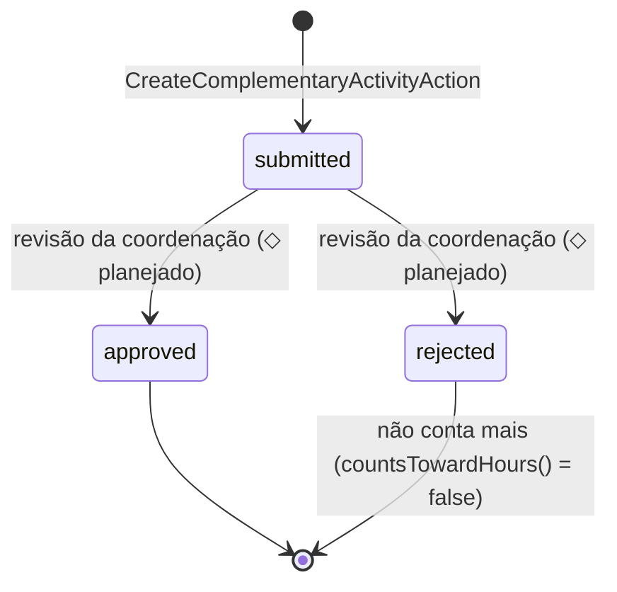

# Horas complementares e certificados — o teto que ninguém conta

> **Área:** `catalog` (o teto) + `journey` (o tracker do aluno) · **Estado:** ATIVO (MVP) · **Última sincronização:** v0.7.0 · 2026-09-19

## O problema de negócio

A resolução de atividades complementares de qualquer curso faz duas coisas:
exige um total de horas, e limita quanto de cada categoria pode contar. A
segunda parte é a que ninguém lê — e descobrir isso no último semestre,
faltando horas, é uma das experiências mais evitáveis da graduação. O bloco
B7 do HackLab (desafio 5.1) resolve isso virando o teto em dado e mostrando,
na hora de declarar, quanto de uma categoria já estourada não vai contar.

Desenho completo em
[`docs-site/features/horas-e-certificados.html`](../../docs-site/features/horas-e-certificados.html) —
canônico para a homologação da coordenação (Fase 3) e a leitura automática do
certificado por IA, que ainda não têm código.

## As regras

1. **O teto é da matriz, não do aluno.** `complementary_categories` pertence
   ao `catalog` (regra de colegiado), não ao `journey` (fato de aluno) —
   mesma razão de `prerequisites` viver no catálogo.
2. **Cada categoria tem um teto (`ccg_max_hours`).** Declarar acima dele não
   é erro — é só informação: a atividade é sempre aceita, e o aviso vem em
   `capped`/`hours_not_counted` na resposta da criação.
3. **O corte é calculado POR CATEGORIA, nunca por certificado.** Três
   certificados de 20h com teto de 50h não "perdem" 10h cada um — o cálculo é
   `min(soma declarada, teto)` sobre a categoria inteira. Dividir a perda
   entre linhas é uma pergunta que ninguém faz; todo mundo pergunta "quanto
   conta no fim" (`ComplementaryHoursReadModel`).
4. **O excedente de uma categoria não escorre para outra.** Cem horas de
   monitoria não compensam a falta de extensão — a regra é da resolução, o
   sistema só a torna visível.
5. **A categoria precisa pertencer à matriz CONGELADA do vínculo do aluno.**
   Declarar contra o teto de uma matriz alheia é recusado (422) — mesma fonte
   de verdade que o resto da progressão usa (`registrations.curriculum_cur_id`).
6. **`complementary_activities` NUNCA soma no `ProgressReadModel`.** Decisão
   do dono do produto (19/09/2026, ver [`PROGRESSAO.md`](PROGRESSAO.md)
   pendência 3): é o tracker pessoal do aluno, puramente informativo.
   `ATV001` — a disciplina de 90h que a matriz real já usa para registrar
   atividades complementares — continua sendo o que de fato conta como
   aprovado dentro de "obrigatórias", quando aparecer no histórico oficial
   importado. As duas fontes não se tocam, de propósito: somar as duas seria
   contar a mesma hora duas vezes sem nenhuma regra de conciliação.
7. **Sem fila de homologação nesta entrega.** A atividade nasce `submitted`
   e o contador anda na hora — com a ressalva de que é declaratório. O ciclo
   completo (`draft → submitted → approved/rejected`, com
   `ActivityStatus::countsTowardHours()` como o único ponto de troca) já está
   modelado; só falta o endpoint de revisão da coordenação.
8. **O caminho do certificado fica fora da trilha de auditoria.** O que se
   audita é a decisão sobre as horas, não onde o byte está guardado — mesmo
   padrão de `erq_file_path` em `enrollment_requests`.

## O fluxo

Leitura (`ComplementaryHoursReadModel::summaryFor`): agrupa as atividades do
vínculo por categoria, filtra as que ainda contam
(`ActivityStatus::countsTowardHours()`), e devolve `hours_claimed` /
`hours_granted` (capado pelo teto) / `hours_not_counted` / `capped` por
categoria.

## Decisões e porquês

| Decisão | Alternativas consideradas | Por que esta | Quando revisitar |
| --- | --- | --- | --- |
| `complementary_activities` nunca soma no `ProgressReadModel` | Alimentar uma faixa nova "Atividades complementares" no total de horas | `ATV001` já soma 90h dentro de "obrigatórias" via o histórico real — uma faixa nova duplicaria a mesma hora sem regra de conciliação. O desafio pede o aluno *acompanhar*, não uma segunda fonte de verdade para o total | Se a coordenação confirmar que `ATV001` deixa de existir como disciplina e as atividades complementares passam a ser SÓ o que este tracker mede |
| `cac_hours_granted` (coluna por atividade) fica sempre `null` nesta entrega | Calcular e gravar o "quanto contou" por linha no momento da criação | O corte automático pelo teto é por CATEGORIA, não por linha (regra 3) — gravar um número por linha reintroduziria a ambiguidade que o desenho pede pra evitar. A coluna existe pronta para a homologação MANUAL futura (a coordenação decide quanto de UMA atividade específica conta) | Quando a Fase 3 (homologação) entrar em código |
| Categoria validada contra `registrations.curriculum_cur_id` (a matriz congelada), não contra "qualquer matriz do curso" | Aceitar qualquer categoria de qualquer matriz do mesmo curso | Mesma fonte de verdade que toda a progressão já usa — evita um aluno de matriz antiga declarar contra o teto (talvez diferente) de uma matriz nova | Se currículos trocarem tetos de categoria com frequência e isso virar fricção real |
| Seed de `complementary_categories` fictício (replica o exemplo do desenho) | Esperar a resolução real do curso para semear qualquer coisa | A demo não pode rodar vazia; o card já registra a pendência explicitamente | Assim que a resolução real de atividades complementares da UTFPR chegar |

## ⚠️ Pendências do dono do produto

1. **Os tetos reais por categoria dependem da resolução do curso.** O seed
   atual (`ComplementaryCategorySeeder`) é fictício — replica o exemplo do
   desenho, não a resolução real da UTFPR.
2. **Homologação da coordenação (Fase 3) não tem código.** Hoje qualquer
   valor declarado conta (`draft`/`submitted` ambos contam); só `rejected`
   não conta, e não existe endpoint pra rejeitar.
3. **Leitura automática do certificado por IA (Fase 2) não tem código.** O
   contrato `AcademicDocumentExtractor` já existe e serviria aos dois casos —
   é só mais um tipo de documento — mas B7 não conectou os dois.

## Mapa de código

| Regra | Onde vive | Teste |
| --- | --- | --- |
| 1 | `catalog/database/migrations/..._create_complementary_categories_table.php` | `CatalogoApiTest` — "expõe o teto por categoria..." |
| 2, 3 | `journey/src/ReadModels/ComplementaryHoursReadModel.php` | `HorasComplementaresTest` — "declarar dentro do teto...", "estourar o teto..." |
| 4 | `journey/src/ReadModels/ComplementaryHoursReadModel.php` (agrupamento por categoria) | `HorasComplementaresTest` — "estourar o teto..." |
| 5 | `journey/src/Actions/CreateComplementaryActivityAction.php` | `HorasComplementaresTest` — "declarar contra categoria de outra matriz..." |
| 6 | Ausência de qualquer leitura de `complementary_activities` em `ProgressReadModel` | `docs/dominio/PROGRESSAO.md` pendência 3 (decisão registrada) |
| 7 | `journey/src/Enums/ActivityStatus.php` | `HorasComplementaresTest` — "atividade rejeitada não conta no resumo" |
| 8 | `journey/src/Observers/ComplementaryActivityObserver.php` | `HorasComplementaresTest` — "o caminho do certificado fica fora da trilha..." |
