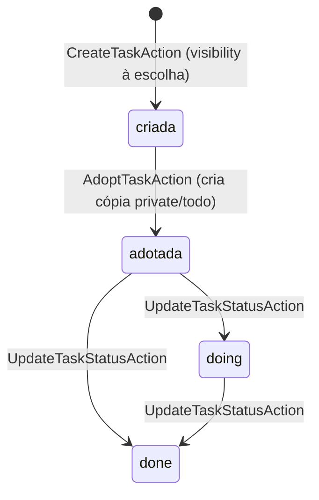

# Tarefas da turma — uma pessoa cadastra, a turma inteira recebe

> **Área:** `lifeos` (B6) · **Estado:** ATIVO (MVP) · **Última sincronização:** v0.6.0 · 2026-09-19

## O problema de negócio

Toda turma tem prazos que só uma parte dela sabe: a prova que mudou de data, o
trabalho que vale nota, a leitura que cai na prova. Hoje isso circula por
grupo de WhatsApp — quem não está no grupo (ou entrou depois) perde o prazo. O
bloco B6 do HackLab resolve isso emprestando a mesma ideia do acervo do
veterano ([`ACERVO.md`](ACERVO.md)), só que aplicada a prazos em vez de
conhecimento: alguém cadastra, a turma inteira enxerga na própria agenda.

Desenho completo em
[`docs-site/features/acervo-compartilhado.html`](../../docs-site/features/acervo-compartilhado.html)
Fase 3 — canônico até este documento assumir a regra por escrito.

## As regras

1. **Uma tarefa NÃO nasce sempre privada** — ao contrário da nota. Cadastrar
   já com `visibility: offering` + `offering_id` é o próprio ato de
   compartilhar com a turma, num passo só. `CreateTaskAction` aceita a
   visibilidade na criação (a nota força `private` e exige uma Action
   separada para publicar; a tarefa não tem esse passo a mais).
2. **`tsk_visibility` é o MESMO enum `Visibility` do acervo de notas** — cinco
   degraus, reaproveitados de propósito. Copiar um enum "quase igual" por
   tabela é a armadilha que o LifeOS original virou ("Em Andamento" ×
   "Em Progresso" como a mesma coisa em tabelas diferentes).
3. **Publicar exige saber para quem**, igual à nota: criar com uma
   visibilidade que exige oferta/disciplina sem a FK correspondente é
   recusado (422) antes de gravar — senão a tarefa nasceria "da turma" e
   invisível pra ela.
4. **Adotar copia, nunca compartilha a linha.** `AdoptTaskAction` cria uma
   CÓPIA privada apontando pra origem (`origin_tsk_id`), sempre com status
   `todo`. Sem isso, o primeiro aluno a marcar como feita marcaria pra turma
   inteira.
5. **Guarda de idempotência.** Índice único `(owner_usr_id, origin_tsk_id)` +
   `firstOrCreate`: duplo clique em "adotar" devolve a mesma cópia, nunca cria
   uma segunda.
6. **Só se adota o que foi compartilhado.** Tentar adotar uma tarefa
   `private` de outra pessoa é 403 — adoção não é uma forma de ler tarefa
   alheia.
7. **A agenda filtra por termo, ao contrário do acervo de notas.**
   `GET /me/agenda` traz as pendências próprias (`status != done`) mais as
   tarefas `offering` das ofertas em que o aluno está matriculado **no termo
   corrente**, ainda não adotadas — ordenado por prazo. Aqui a ausência de
   filtro seria o bug: prazo de turma passada é ruído (diferente da nota, cujo
   valor está em atravessar semestres).
8. **Só o dono muda o status da própria tarefa.** A cópia adotada passa a ser
   seu domínio a partir da adoção; quem só recebeu na agenda sem adotar
   recebe 403 ao tentar mudar o status da tarefa original.

## O fluxo

A tarefa original nunca muda de dono nem de status por causa de uma adoção —
a cópia é que anda sozinha dali em diante.

## Decisões e porquês

| Decisão | Alternativas consideradas | Por que esta | Quando revisitar |
| --- | --- | --- | --- |
| Tarefa nasce direto com a visibilidade escolhida, sem passo de publicação separado | Forçar `private` sempre + Action de publicação, espelhando `UpdateNoteVisibilityAction` | O desenho descreve "cadastra já na turma" como ato único; forçar simetria com `Note` criaria um passo a mais que ninguém pediu | Se o produto quiser um rascunho de tarefa antes de publicar |
| "Em quais ofertas o aluno está matriculado agora" respondida direto via `config('models.*')` dentro do `lifeos` (`AgendaReadModel::currentOfferingIdsFor`) | Um método novo no contrato `EnrolledSubjectsProvider` (`currentOfferingIdsFor`) | Consulta por FK simples, sem a regra de negócio "atravessar termo" que justificou o contrato original — mesmo raciocínio que já vale para `NoteVisibilityScope::offeringIdsFor`/`courseIdsFor` | Se a pergunta ganhar uma regra própria além do status do termo |
| `Task` não tem um global scope de visibilidade (ao contrário de `NoteVisibilityScope`) | Espelhar `NoteVisibilityScope` para tarefas, com os 5 níveis lidos em toda query | Nenhum endpoint do B6 lista tarefa de terceiro fora da agenda, que já filtra explicitamente (`offering` + oferta do termo atual + não adotada) — um scope genérico cobriria capacidade que nada usa hoje | Se surgir um `GET /tasks?subject_id=` (acervo de tarefas por disciplina), nos moldes de `GET /notes` |
| Mudança de status é um endpoint dedicado (`PATCH /tasks/{id}/status`) | Um update genérico (título, descrição, prazo, status juntos) | O desenho só pede "marca como feita"; entregar exatamente isso evita superfície sem teste | Se o front precisar editar título/descrição/prazo da própria tarefa |

## ⚠️ Pendências do dono do produto

1. **Curadoria de tarefas e o tipo `events`** — Fase 4 (◎ esticada) do desenho
   segue sem código; esta entrega cobre só a Fase 3 (B6, ⚑ MVP).
2. **Sem edição de conteúdo** depois de criada: só criação, adoção e mudança
   de status. Se o front precisar editar título/descrição/prazo, é uma Action
   pequena a mais (autor apenas).
3. **Avisar quem adotou quando a origem muda o prazo** ("o professor adiou a
   prova") — o vínculo `origin_tsk_id` já existe pra isso, mas não há
   notificação nem propagação automática ainda.

## Mapa de código

| Regra | Onde vive | Teste |
| --- | --- | --- |
| 1, 3 | `lifeos/src/Actions/CreateTaskAction.php` | `TarefasDaTurmaTest` — "cadastrar já na turma dispensa..."/"cadastrar para a turma sem informar..." |
| 2 | `lifeos/src/Models/Task.php` (cast `tsk_visibility` ⇒ `Lifeos\Enums\Visibility`) | — (reaproveitamento do enum, sem teste dedicado) |
| 4 | `lifeos/src/Actions/AdoptTaskAction.php` | `TarefasDaTurmaTest` — "adotar copia a tarefa da turma..." |
| 5 | `lifeos/src/Actions/AdoptTaskAction.php` (`firstOrCreate`) + migration (índice único) | `TarefasDaTurmaTest` — "duplo clique em adotar..." |
| 6 | `lifeos/src/Actions/AdoptTaskAction.php` | `TarefasDaTurmaTest` — "adotar uma tarefa privada..." |
| 7 | `lifeos/src/ReadModels/AgendaReadModel.php` | `TarefasDaTurmaTest` — "a agenda traz a pendência própria...", "tarefa de oferta de termo passado...", "depois de adotar..." |
| 8 | `lifeos/src/Http/Controllers/TaskController.php::assertOwner` | `TarefasDaTurmaTest` — "só o dono muda o status...", "marcar como feita..." |
